# KI-Personenerkennung System

Ein umfassendes System zur automatisierten Personenerkennung in klassifizierten Bilddaten mit vier verschiedenen KI-Modellen: Ultralytics YOLO, DeepFace, Gemma/LLaVA und Ollama Gemma 3.

## 🚀 Features

- **Vier KI-Modelle**: Ultralytics YOLO, DeepFace, Gemma/LLaVA und **Ollama Gemma 3** für verschiedene Erkennungsansätze
- **Randomisierte Verarbeitung**: Verhindert Bias durch sequenzielle Verarbeitung gleicher Klassifizierungen
- **Konfidenz-Tracking**: Erkennt unsichere Vorhersagen und speichert Wahrscheinlichkeitswerte
- **MySQL Integration**: Vollständige Speicherung aller Ergebnisse mit Run-Tracking
- **Systemmonitoring**: CPU, RAM und GPU Auslastung während der Verarbeitung
- **Cronjob-fähig**: Automatisierte Ausführung über Zeitpläne
- **Performance-Metriken**: Detaillierte Zeitmessungen pro Bild und Run
- **Ollama Support**: Optimierte lokale KI-Ausführung mit geringem Ressourcenverbrauch
- **Flexible Testumgebung**: Separate Testscripts für einzelne Modelle

## 📁 Projektstruktur

```
person_detection/
├── BaseDetector.py                  # Abstrakte Basisklasse für Detektoren
├── DataLoader.py                    # Lädt und verwaltet klassifizierte Bilddaten
├── DatabaseHandler.py               # MySQL Datenbankoperationen
├── DetectionProcessor.py            # Hauptverarbeitungslogik (KORRIGIERT)
├── SystemMonitor.py                 # Systemressourcen-Monitoring
├── UltralyticsPersonDetector.py     # YOLO-basierte Personenerkennung
├── DeepFacePersonDetector.py        # Gesichtsbasierte Personenerkennung (KORRIGIERT)
├── GemmaPersonDetector.py           # LLM-basierte Personenerkennung (KORRIGIERT)
├── OllamaGemma3PersonDetector.py    # 🆕 Ollama Gemma 3 Integration
├── run_person_detection.py          # Hauptausführungsscript (ERWEITERT)
├── setup_environment.py             # Setup und Konfigurationstool
├── cronjob_setup.sh                # Cronjob-Automatisierung
├── setup_ollama.sh                 # 🆕 Ollama Installation und Setup
├── test_models.sh                  # 🆕 Separate Testscripts für alle Modelle
├── quick_test.py                   # 🆕 Schnelltest ohne Datenbank
├── test_ollama_gemma3.py           # 🆕 Spezieller Ollama-Test
├── database_schema.sql              # MySQL Datenbankschema
├── requirements.txt                 # Python-Abhängigkeiten (AKTUALISIERT)
├── requirements_ollama.txt          # 🆕 Erweiterte Requirements mit Ollama
└── documentation.md                 # Diese vervollständigte Dokumentation
```

## 🛠️ Installation

### 1. Repository klonen und grundlegendes Setup

```bash
git clone <repository-url>
cd person_detection

# Python-Umgebung erstellen (empfohlen)
python3 -m venv venv
source venv/bin/activate

# Basis-Dependencies installieren
pip install -r requirements.txt

# Setup-Script ausführen
python3 setup_environment.py --install --test-models --create-testdata ./data
```

### 2. Ollama Installation (Empfohlen für Gemma 3)

```bash
# Ollama Setup-Script ausführbar machen
chmod +x setup_ollama.sh

# Vollständige Ollama-Installation
./setup_ollama.sh install

# Oder manuell:
curl -fsSL https://ollama.com/install.sh | sh
ollama serve &
ollama pull gemma3:4b
```

### 3. Alternative: HuggingFace Gemma (GPU-intensiv)

```bash
# Erweiterte Requirements für HuggingFace-basierte Modelle
pip install -r requirements_ollama.txt
```

### 4. MySQL Datenbank einrichten

```bash
# Datenbank und Tabellen erstellen
mysql -u root -p < database_schema.sql

# Benutzer und Berechtigungen erstellen
mysql -u root -p -e "
CREATE USER 'ai_detection_user'@'localhost' IDENTIFIED BY 'secure_password_here';
GRANT SELECT, INSERT, UPDATE ON ai_detection.* TO 'ai_detection_user'@'localhost';
FLUSH PRIVILEGES;
"
```

### 5. Konfiguration anpassen

Bearbeiten Sie die Datenbankverbindung in den Scripts:

```bash
# Beispiel-Konfiguration kopieren
cp example_run.sh my_config.sh
nano my_config.sh  # DB-Daten anpassen
```

## 📊 Datenstruktur

### Klassifizierte Bilddaten

Organisieren Sie Ihre Bilder in folgender Struktur:

```
classified_images/
├── with_people/
│   ├── family_photo_001.jpg
│   ├── person_portrait_002.png
│   └── group_meeting_003.jpg
├── without_people/
│   ├── landscape_001.jpg
│   ├── building_002.png
│   └── nature_003.jpg
├── group_photos/
│   ├── team_photo_001.jpg
│   └── conference_002.jpg
├── uncertain/
│   ├── crowded_scene_001.jpg
│   └── distant_figures_002.jpg
└── sports/
    ├── football_game_001.jpg
    └── athletics_002.jpg
```

**Unterstützte Formate**: `.jpg`, `.jpeg`, `.png`, `.bmp`, `.tiff`, `.tif`, `.webp`

## 🎯 Verwendung

### Schnelltests (ohne Datenbank)

```bash
# Einfacher Test mit automatisch erstellten Bildern
python3 quick_test.py --model ultralytics --create-test-image

# Test aller Modelle mit eigenem Bildverzeichnis
python3 quick_test.py --model all --data-dir /path/to/images --max-images 5

# Nur Ollama Gemma 3 testen
python3 test_ollama_gemma3.py --create-images --models gemma3:270m gemma3:4b
```

### Einzelne Modell-Tests

```bash
# Test-Script konfigurieren
chmod +x test_models.sh
nano test_models.sh  # Pfade und DB-Daten anpassen

# Einzelne Tests
./test_models.sh ultralytics     # Nur YOLO
./test_models.sh deepface        # Nur DeepFace (alle Backends)
./test_models.sh gemma          # Nur HuggingFace Gemma
./test_models.sh prerequisites   # Systemcheck

# Schnelltest aller Modelle
./test_models.sh quick
```

### Produktive Einzelausführung

#### Ultralytics YOLO (Empfohlen für große Datenmengen)
```bash
python3 run_person_detection.py \
    --model ultralytics \
    --db-host localhost \
    --db-user ai_detection_user \
    --db-password your_password \
    --db-name ai_detection \
    --data-dir /path/to/images \
    --max-images 500 \
    --confidence-threshold 0.6 \
    --run-name "daily_ultralytics_scan" \
    --yolo-model-path yolov8n.pt
```

#### DeepFace mit verschiedenen Backends
```bash
# OpenCV Backend (Standard)
python3 run_person_detection.py \
    --model deepface \
    --deepface-backend opencv \
    --max-images 100 \
    --confidence-threshold 0.5 \
    [weitere Parameter...]

# MTCNN Backend (bessere Genauigkeit)
python3 run_person_detection.py \
    --model deepface \
    --deepface-backend mtcnn \
    --max-images 50 \
    --confidence-threshold 0.5 \
    [weitere Parameter...]

# RetinaFace Backend (beste Qualität)
python3 run_person_detection.py \
    --model deepface \
    --deepface-backend retinaface \
    --max-images 30 \
    --confidence-threshold 0.5 \
    [weitere Parameter...]
```

#### Ollama Gemma 3 (Empfohlen für Qualitätskontrolle)
```bash
# Gemma 3 4B (beste Balance)
python3 run_person_detection.py \
    --model ollama-gemma3 \
    --ollama-model gemma3:4b \
    --ollama-host http://localhost:11434 \
    --max-images 50 \
    --confidence-threshold 0.7 \
    [weitere Parameter...]

# Gemma 3 270M (sehr schnell)
python3 run_person_detection.py \
    --model ollama-gemma3 \
    --ollama-model gemma3:270m \
    --max-images 100 \
    --confidence-threshold 0.6 \
    [weitere Parameter...]
```

#### HuggingFace Gemma (GPU erforderlich)
```bash
python3 run_person_detection.py \
    --model gemma \
    --gemma-model llava-hf/llava-1.5-7b-hf \
    --max-images 20 \
    --confidence-threshold 0.7 \
    [weitere Parameter...]
```

### Automatisierte Ausführung (Cronjobs)

```bash
# Cronjob-Script konfigurieren
cp cronjob_setup.sh /opt/person_detection/cronjob_setup.sh
chmod +x /opt/person_detection/cronjob_setup.sh
nano /opt/person_detection/cronjob_setup.sh  # Pfade und Parameter anpassen

# Cronjobs installieren
/opt/person_detection/cronjob_setup.sh install-cron

# Manuelle Ausführung verschiedener Szenarien
/opt/person_detection/cronjob_setup.sh morning    # Schneller Morgenscan
/opt/person_detection/cronjob_setup.sh afternoon  # Detaillierte Analyse
/opt/person_detection/cronjob_setup.sh evening    # Umfassende Analyse
/opt/person_detection/cronjob_setup.sh weekly     # Vollscan
```

**Standard Cronjob-Zeiten:**
- **07:30**: Morgendlicher Schnellscan (Ultralytics, 200 Bilder)
- **14:00**: Detaillierte Nachmittags-Analyse (Ultralytics + DeepFace)
- **20:00**: Umfassende Abend-Analyse (alle verfügbaren Modelle)
- **So 02:00**: Wöchentlicher Vollscan (unbegrenzt)
- **01:00**: Tägliche Log-Bereinigung

## 🤖 KI-Modelle im Detail

### 1. Ultralytics YOLO v8
- **Typ**: Objekterkennung (Computer Vision)
- **Stärken**: 
  - ⚡ Sehr schnell (5-50ms pro Bild)
  - 🎯 Präzise Bounding Boxes
  - 📊 Zuverlässige Konfidenzwerte
  - 🔧 Einfache Integration
- **Schwächen**: 
  - Nur vortrainierte COCO-Klassen
  - Probleme bei sehr kleinen oder verdeckten Personen
- **Empfohlene Nutzung**: Hauptscan für große Bildmengen
- **Ressourcen**: 2-4GB RAM, optional GPU

### 2. DeepFace
- **Typ**: Gesichtserkennung (Computer Vision)
- **Backends**: OpenCV, SSD, MTCNN, RetinaFace
- **Stärken**:
  - 👤 Erkennt Personen über Gesichter
  - 🎭 Verschiedene Backends für unterschiedliche Anforderungen
  - 📐 Detaillierte Gesichtsanalyse möglich
- **Schwächen**:
  - Nur frontal sichtbare Gesichter
  - Probleme bei schlechten Lichtverhältnissen
  - Verpasst Personen ohne sichtbare Gesichter
- **Empfohlene Nutzung**: Portrait-Bilder, Qualitätskontrolle
- **Ressourcen**: 2-6GB RAM, optional GPU

### 3. Gemma/LLaVA (HuggingFace)
- **Typ**: Vision-Language Model (Multimodal AI)
- **Stärken**:
  - 🧠 Versteht Bildkontext
  - 💬 Kann komplexe Szenen analysieren
  - 🎨 Kreative Problemlösung
  - 📝 Natürliche Sprachausgabe
- **Schwächen**:
  - 🐌 Sehr langsam (10-60s pro Bild)
  - 🔥 Hoher GPU-Speicherbedarf
  - ❌ Keine exakten Bounding Boxes
  - 🎲 Inkonsistente Ergebnisse
- **Empfohlene Nutzung**: Qualitätskontrolle, komplexe Szenen, kleine Bildmengen
- **Ressourcen**: 8-16GB GPU-VRAM erforderlich

### 4. Ollama Gemma 3 ⭐ **NEU & EMPFOHLEN**
- **Typ**: Optimiertes Vision-Language Model (Lokale AI)
- **Verfügbare Modelle**:
  - `gemma3:270m` - 292MB, sehr schnell (1-3s)
  - `gemma3:1b` - 1.4GB, gute Balance (2-5s)
  - `gemma3:4b` - 3.3GB, beste Qualität/Performance (3-8s)
  - `gemma3:12b` - 8.8GB, hohe Qualität (5-15s)
  - `gemma3:27b` - 19GB, beste Qualität (10-30s)
- **Stärken**:
  - ⚡ Deutlich schneller als HuggingFace-Version
  - 💾 Optimierter Speicherverbrauch
  - 🔧 Einfache REST-API
  - 🏠 Vollständig lokal (keine Internetverbindung nötig)
  - 📱 Läuft auch ohne GPU (CPU-optimiert)
  - 🎯 Konsistentere Ergebnisse als HF-Version
- **Schwächen**:
  - ❌ Keine exakten Bounding Boxes
  - 🆕 Neuere Technologie (weniger getestet)
- **Empfohlene Nutzung**: Qualitätskontrolle, mittlere Bildmengen, lokale Deployments
- **Ressourcen**: 1-8GB RAM je nach Modell, GPU optional

## 📈 Datenbankschema

### Erweiterte Tabellen

#### Tabelle: `ai_runs`
```sql
CREATE TABLE ai_runs (
    run_id VARCHAR(36) PRIMARY KEY,           -- UUID für jeden Run
    model_name VARCHAR(100) NOT NULL,        -- z.B. 'Ultralytics YOLO', 'Ollama-Gemma3'
    model_version VARCHAR(50),               -- z.B. 'v8', '4b'
    start_time DATETIME NOT NULL,
    end_time DATETIME,
    total_images INT DEFAULT 0,
    successful_detections INT DEFAULT 0,
    failed_detections INT DEFAULT 0,
    avg_processing_time FLOAT,              -- Durchschnitt pro Bild
    total_processing_time FLOAT,            -- Gesamtzeit
    avg_cpu_usage FLOAT,                    -- Durchschnittliche CPU%
    max_cpu_usage FLOAT,                    -- Peak CPU%
    avg_memory_usage FLOAT,                 -- Durchschnittliches RAM%
    max_memory_usage FLOAT,                 -- Peak RAM%
    avg_gpu_usage FLOAT,                    -- Durchschnittliche GPU%
    max_gpu_usage FLOAT,                    -- Peak GPU%
    status ENUM('running', 'completed', 'failed', 'cancelled'),
    error_message TEXT,
    config_json TEXT                        -- Verwendete Parameter als JSON
);
```

#### Tabelle: `detection_results`
```sql
CREATE TABLE detection_results (
    id INT AUTO_INCREMENT PRIMARY KEY,
    run_id VARCHAR(36) NOT NULL,
    image_path VARCHAR(500) NOT NULL,
    image_filename VARCHAR(255) NOT NULL,
    classification VARCHAR(100),            -- Original-Klassifizierung
    model_output JSON,                      -- Vollständiges Modellergebnis
    confidence_scores TEXT,                 -- Komma-getrennte Konfidenzwerte
    processing_time FLOAT NOT NULL,         -- Zeit für dieses Bild
    success BOOLEAN DEFAULT TRUE,
    error_message TEXT,
    timestamp DATETIME DEFAULT CURRENT_TIMESTAMP,
    
    -- Automatisch extrahierte Felder (via Trigger)
    persons_detected INT DEFAULT 0,         -- Anzahl erkannter Personen
    avg_confidence FLOAT,                   -- Durchschnitts-Konfidenz
    max_confidence FLOAT,                   -- Höchste Konfidenz
    min_confidence FLOAT,                   -- Niedrigste Konfidenz
    is_uncertain BOOLEAN DEFAULT FALSE,     -- Flag für unsichere Erkennungen
    
    FOREIGN KEY (run_id) REFERENCES ai_runs(run_id) ON DELETE CASCADE
);
```

### Nützliche Views

#### Modellvergleich
```sql
CREATE VIEW model_comparison AS
SELECT 
    model_name,
    model_version,
    COUNT(DISTINCT run_id) as total_runs,
    SUM(total_images) as total_images_processed,
    SUM(successful_detections) as total_successful,
    ROUND(AVG(avg_processing_time), 3) as avg_time_per_image,
    ROUND(AVG(avg_cpu_usage), 1) as avg_cpu,
    ROUND(AVG(avg_memory_usage), 1) as avg_memory,
    ROUND(SUM(successful_detections) / NULLIF(SUM(total_images), 0) * 100, 2) as success_rate_percent
FROM ai_runs
WHERE status = 'completed'
GROUP BY model_name, model_version
ORDER BY total_images_processed DESC;
```

## 📊 Auswertung und Monitoring

### Wichtige SQL-Abfragen

#### Performance-Vergleich der Modelle
```sql
-- Geschwindigkeit und Erfolgsrate
SELECT 
    model_name,
    COUNT(*) as runs,
    ROUND(AVG(avg_processing_time), 3) as avg_seconds_per_image,
    ROUND(AVG(successful_detections / NULLIF(total_images, 0) * 100), 2) as success_rate_percent,
    ROUND(AVG(avg_cpu_usage), 1) as avg_cpu_usage,
    ROUND(AVG(avg_memory_usage), 1) as avg_memory_usage
FROM ai_runs 
WHERE status = 'completed' AND start_time >= DATE_SUB(NOW(), INTERVAL 30 DAY)
GROUP BY model_name
ORDER BY avg_seconds_per_image;
```

#### Top-Performer nach Klassifizierung
```sql
-- Welche Modelle arbeiten bei welchen Bildtypen am besten
SELECT 
    dr.classification,
    ar.model_name,
    COUNT(*) as images_processed,
    ROUND(AVG(dr.persons_detected), 2) as avg_persons_found,
    ROUND(AVG(dr.avg_confidence), 3) as avg_confidence,
    COUNT(CASE WHEN dr.is_uncertain = TRUE THEN 1 END) as uncertain_detections
FROM detection_results dr
JOIN ai_runs ar ON dr.run_id = ar.run_id
WHERE dr.success = TRUE AND ar.status = 'completed'
GROUP BY dr.classification, ar.model_name
ORDER BY dr.classification, avg_confidence DESC;
```

#### Fehleranalyse
```sql
-- Häufigste Fehler pro Modell
SELECT 
    ar.model_name,
    dr.error_message,
    COUNT(*) as error_count,
    ROUND(COUNT(*) / (SELECT COUNT(*) FROM detection_results dr2 
                      JOIN ai_runs ar2 ON dr2.run_id = ar2.run_id 
                      WHERE ar2.model_name = ar.model_name) * 100, 2) as error_percentage
FROM detection_results dr
JOIN ai_runs ar ON dr.run_id = ar.run_id
WHERE dr.success = FALSE
GROUP BY ar.model_name, dr.error_message
ORDER BY error_count DESC;
```

#### Ressourcenverbrauch-Trends
```sql
-- CPU/Memory Trends über Zeit
SELECT 
    DATE(start_time) as date,
    model_name,
    ROUND(AVG(avg_cpu_usage), 1) as daily_avg_cpu,
    ROUND(AVG(avg_memory_usage), 1) as daily_avg_memory,
    ROUND(AVG(avg_gpu_usage), 1) as daily_avg_gpu,
    SUM(total_images) as daily_images_processed
FROM ai_runs 
WHERE status = 'completed' AND start_time >= DATE_SUB(NOW(), INTERVAL 7 DAY)
GROUP BY DATE(start_time), model_name
ORDER BY date DESC, model_name;
```

## ⚙️ Erweiterte Konfiguration

### Parameter-Optimierung nach Szenario

#### Für große Datenmengen (>1000 Bilder)
```bash
# Ultralytics: Hohe Geschwindigkeit
--model ultralytics --confidence-threshold 0.7 --max-images 1000

# Ollama Gemma3 270M: Schnelle Qualitätskontrolle  
--model ollama-gemma3 --ollama-model gemma3:270m --confidence-threshold 0.6 --max-images 500
```

#### Für hohe Genauigkeit (Qualitätskontrolle)
```bash
# DeepFace RetinaFace: Beste Gesichtserkennung
--model deepface --deepface-backend retinaface --confidence-threshold 0.8 --max-images 100

# Ollama Gemma3 4B: Beste LLM-basierte Analyse
--model ollama-gemma3 --ollama-model gemma3:4b --confidence-threshold 0.8 --max-images 200
```

#### Für begrenzte Ressourcen
```bash
# Ultralytics: Minimal Setup
--model ultralytics --confidence-threshold 0.5 --max-images 100

# Ollama Gemma3 270M: Minimaler Speicherbedarf
--model ollama-gemma3 --ollama-model gemma3:270m --confidence-threshold 0.5 --max-images 50
```

### Cronjob-Strategien

#### Strategie 1: Geschwindigkeitsfokus
```bash
# Häufige schnelle Scans
*/30 * * * * /path/to/cronjob_setup.sh morning  # Alle 30 Min Ultralytics
0 */4 * * * /path/to/cronjob_setup.sh cleanup   # Alle 4h Bereinigung
```

#### Strategie 2: Qualitätsfokus  
```bash
# Seltene, aber gründliche Analysen
0 8 * * * run_person_detection.py --model ultralytics --max-images 500
0 12 * * * run_person_detection.py --model deepface --deepface-backend mtcnn --max-images 200  
0 16 * * * run_person_detection.py --model ollama-gemma3 --ollama-model gemma3:4b --max-images 100
```

#### Strategie 3: Hybrid-Ansatz (Empfohlen)
```bash
# Morgendlicher Schnellscan
30 7 * * * run_person_detection.py --model ultralytics --max-images 200 --confidence-threshold 0.6

# Nachmittags Ollama für Qualitätskontrolle
0 14 * * * run_person_detection.py --model ollama-gemma3 --ollama-model gemma3:270m --max-images 100

# Abends detaillierte Analyse bei Bedarf
0 20 * * 1-5 run_person_detection.py --model deepface --deepface-backend retinaface --max-images 50

# Wochenend-Vollscan
0 2 * * 6 run_person_detection.py --model ultralytics --confidence-threshold 0.5 # Unbegrenzt
```

## 🐛 Troubleshooting

### Häufige Probleme und Lösungen

#### 1. Import-Fehler
```bash
# Problem: ModuleNotFoundError
# Lösung: Virtuelle Umgebung aktivieren und Dependencies neu installieren
source venv/bin/activate
pip install -r requirements_ollama.txt

# Bei persistenten Problemen
pip uninstall <problematic-package>
pip install <problematic-package> --no-cache-dir
```

#### 2. Ollama-Verbindungsprobleme
```bash
# Prüfe Ollama-Status
curl http://localhost:11434/api/tags

# Starte Ollama neu
pkill ollama
ollama serve &

# Prüfe verfügbare Modelle
ollama list

# Lade fehlendes Modell
ollama pull gemma3:4b
```

#### 3. GPU/CUDA Probleme
```bash
# Prüfe CUDA-Installation
nvidia-smi
python3 -c "import torch; print(torch.cuda.is_available())"

# Bei HuggingFace Gemma Speicherproblemen
export CUDA_VISIBLE_DEVICES=""  # Erzwinge CPU-Nutzung
# Oder reduziere Batch-Size und nutze kleineres Modell
```

#### 4. MySQL Verbindungsfehler
```bash
# Service prüfen
sudo systemctl status mysql

# Verbindung testen
mysql -h localhost -u ai_detection_user -p ai_detection

# Bei Authentifizierungsfehlern
mysql -u root -p -e "ALTER USER 'ai_detection_user'@'localhost' IDENTIFIED WITH mysql_native_password BY 'new_password';"
```

#### 5. DeepFace Backend-Probleme
```bash
# Bei MTCNN/RetinaFace Problemen - Fallback zu OpenCV
--deepface-backend opencv

# Bei TensorFlow-Konflikten
pip install tensorflow==2.13.0 --force-reinstall
```

#### 6. Speicher-/Performance-Probleme
```bash
# Reduziere gleichzeitige Verarbeitung
--max-images 10

# Für Ollama: Nutze kleineres Modell
--ollama-model gemma3:270m

# Systemressourcen überwachen
htop
nvidia-smi -l 1
```

### Log-Analyse

```bash
# Haupt-Logs
tail -f logs/cronjob.log

# Modell-spezifische Logs
tail -f logs/ultralytics_*.log
tail -f logs/deepface_*.log  
tail -f logs/gemma_*.log
tail -f logs/ollama_*.log

# Fehler-Pattern suchen
grep -i "error\|failed\|exception" logs/*.log

# Performance-Analyse
grep "Zeit:" logs/*.log | awk '{print $NF}' | sort -n
```

## 📊 Performance-Benchmarks

### Typische Leistungswerte (orientativ)

| Modell | Bilder/Min | CPU % | RAM GB | GPU GB | Genauigkeit* |
|--------|------------|--------|---------|--------|-------------|
| **Ultralytics YOLO** | 120-600 | 30-60 | 2-4 | 1-2 | 85-92% |
| **DeepFace (OpenCV)** | 20-80 | 40-80 | 3-5 | 0-1 | 70-85% |
| **DeepFace (MTCNN)** | 10-30 | 60-90 | 4-6 | 1-2 | 80-90% |
| **DeepFace (RetinaFace)** | 5-15 | 70-95 | 5-7 | 2-3 | 85-95% |
| **Ollama Gemma3:270m** | 20-60 | 40-70 | 1-2 | 0 | 75-85% |
| **Ollama Gemma3:4b** | 8-25 | 50-80 | 4-6 | 0-2 | 80-90% |
| **HF Gemma/LLaVA** | 1-3 | 80-100 | 8-12 | 6-12 | 75-90% |

*Genauigkeit ist stark abhängig von Bildqualität und -typ

### Empfohlene Hardware-Konfigurationen

#### Minimal-Setup (Entwicklung/Tests)
- **CPU**: 4 Kerne, 2.5+ GHz
- **RAM**: 8GB
- **GPU**: Optional (integrierte GPU ausreichend)
- **Speicher**: 50GB frei
- **Empfohlene Modelle**: Ultralytics, Ollama Gemma3:270m

#### Standard-Setup (Produktion)
- **CPU**: 8 Kerne, 3.0+ GHz  
- **RAM**: 16GB
- **GPU**: GTX 1660 / RTX 3060 (6GB VRAM)
- **Speicher**: 200GB frei
- **Empfohlene Modelle**: Alle außer HF Gemma

#### High-Performance Setup
- **CPU**: 12+ Kerne, 3.5+ GHz
- **RAM**: 32GB+
- **GPU**: RTX 4070/4080 (12GB+ VRAM)
- **Speicher**: 500GB+ SSD
- **Empfohlene Modelle**: Alle Modelle parallel

## 🔄 Workflow-Strategien

### Strategie 1: Schnellscan mit Qualitätskontrolle


### Strategie 2: Multi-Model Ensemble


### Strategie 3: Hierarchische Verarbeitung

```mermaid
graph TD
    A[Alle Bilder] --> B[Ultralytics Vorsortierung]
    B --> C{Personen > 0?}
    C -->|Ja| D[DeepFace Detailanalyse]
    C -->|Nein| E[Ollama Doppelcheck]
    D --> F[Hochqualitative Ergebnisse]
    E --> G{Personen gefunden?}
    G -->|Ja| D
    G -->|Nein| H[Bestätigt: Keine Personen]
```


## 🚀 Deployment-Szenarien

### Szenario 1: Lokaler Desktop
```bash
# Setup für Einzelarbeitsplatz
python3 setup_environment.py --install --create-testdata ./data
./setup_ollama.sh install
python3 quick_test.py --model all --create-test-image
```

### Szenario 2: Server-basiert (Ubuntu/Debian)
```bash
# Server-Installation
sudo apt update && sudo apt install -y python3 python3-venv mysql-server
git clone <repo> /opt/person_detection
cd /opt/person_detection

# Service-Setup
sudo cp systemd/person-detection.service /etc/systemd/system/
sudo systemctl enable person-detection
sudo systemctl start person-detection

# Cronjobs für automatische Verarbeitung
sudo crontab -e
# Füge Cronjobs aus cronjob_setup.sh hinzu
```

### Szenario 3: Docker-Container
```dockerfile
FROM python:3.9-slim

WORKDIR /app
COPY requirements_ollama.txt .
RUN pip install -r requirements_ollama.txt

# Ollama Installation
RUN curl -fsSL https://ollama.com/install.sh | sh

COPY . .
EXPOSE 11434 8080

CMD ["bash", "-c", "ollama serve & sleep 10 && ollama pull gemma3:4b && python3 run_person_detection.py"]
```

### Szenario 4: Cloud-Deployment (AWS/GCP)
```bash
# AWS EC2 mit GPU
# Instance-Typ: g4dn.xlarge oder g5.xlarge
# AMI: Deep Learning AMI (Ubuntu)

# Auto-Scaling basierend auf Bildqueue
aws autoscaling create-auto-scaling-group \
    --auto-scaling-group-name person-detection-asg \
    --min-size 1 --max-size 5 --desired-capacity 1
```

## 📈 Monitoring und Alerting

### System-Metriken überwachen
```bash
# Prometheus/Grafana Integration
# monitoring/prometheus.yml
- job_name: 'person-detection'
  static_configs:
    - targets: ['localhost:8080']
  metrics_path: '/metrics'
```

### Custom Alerts einrichten
```yaml
# alerts.yml
groups:
- name: person_detection_alerts
  rules:
  - alert: HighErrorRate
    expr: (failed_detections / total_detections) > 0.1
    for: 5m
    annotations:
      summary: "Hohe Fehlerrate in Personenerkennung"
  
  - alert: SlowProcessing  
    expr: avg_processing_time > 10
    for: 2m
    annotations:
      summary: "Langsame Verarbeitung erkannt"
```

### Dashboard-Metriken
```sql
-- Key Performance Indicators für Dashboard
SELECT 
    DATE(start_time) as date,
    COUNT(*) as total_runs,
    SUM(total_images) as images_processed,
    ROUND(AVG(avg_processing_time), 2) as avg_speed,
    SUM(successful_detections) as successful_detections,
    ROUND(SUM(successful_detections) / SUM(total_images) * 100, 2) as success_rate
FROM ai_runs 
WHERE start_time >= DATE_SUB(NOW(), INTERVAL 30 DAY)
GROUP BY DATE(start_time)
ORDER BY date DESC;
```

## 🧪 Testing & Validation

### Unit Tests
```bash
# Teste einzelne Komponenten
python3 -m pytest tests/test_detectors.py -v
python3 -m pytest tests/test_database.py -v
python3 -m pytest tests/test_processing.py -v
```

### Integration Tests
```bash
# Ende-zu-Ende Tests
python3 tests/integration_test.py --test-all-models --max-images 5
```

### Performance Tests
```bash
# Benchmark verschiedener Konfigurationen
python3 tests/benchmark.py --models ultralytics ollama-gemma3 --images 100
```

### Validation Dataset erstellen
```bash
# Erstelle Ground Truth Datensatz
python3 tools/create_validation_set.py \
    --input-dir /path/to/images \
    --output-dir /path/to/validation \
    --sample-size 1000 \
    --manual-annotation
```

## 🔐 Sicherheit & Datenschutz

### Datenschutz-Überlegungen
- **Lokale Verarbeitung**: Alle Modelle laufen lokal, keine Cloud-APIs
- **Datenminimierung**: Nur notwendige Metadaten werden gespeichert
- **Anonymisierung**: Keine Gesichtserkennung zur Identifikation
- **Zugriffsschutz**: MySQL-Benutzerrechte beschränken

### Sicherheits-Checkliste
```bash
# MySQL Security
mysql_secure_installation

# OS-Level Security
sudo ufw enable
sudo ufw allow 22  # SSH
sudo ufw allow 3306/tcp  # MySQL nur von localhost

# Application Security
# Verwende Environment Variables für Passwörter
export DB_PASSWORD="secure_random_password"
# Keine Passwörter in Scripts hart kodieren
```

### DSGVO-Konformität
```bash
# Datenaufbewahrung begrenzen
# In database_schema.sql:
CREATE EVENT delete_old_results
ON SCHEDULE EVERY 1 DAY
DO DELETE FROM detection_results 
WHERE timestamp < DATE_SUB(NOW(), INTERVAL 365 DAY);
```

## 📚 API-Referenz

### REST API (Optional)
```python
# api_server.py - Flask-basierte API
from flask import Flask, request, jsonify
from DetectionProcessor import DetectionProcessor

app = Flask(__name__)

@app.route('/detect', methods=['POST'])
def detect_persons():
    # API-Endpunkt für externe Nutzung
    pass

@app.route('/status', methods=['GET']) 
def get_status():
    # System-Status abfragen
    pass
```

### CLI-Interface
```bash
# Vollständige CLI-Optionen
python3 run_person_detection.py --help

# Beispiel: Batch-Verarbeitung mit JSON-Config
python3 run_person_detection.py --config config.json
```

## 🎓 Best Practices

### Code-Organisation
1. **Modulare Architektur**: Jeder Detektor als separate Klasse
2. **Error Handling**: Umfassende Exception-Behandlung
3. **Logging**: Strukturierte Logs für Debugging
4. **Configuration**: Externe Konfigurationsdateien
5. **Testing**: Automatisierte Tests für alle Komponenten

### Performance-Optimierung
1. **Batch Processing**: Mehrere Bilder gleichzeitig verarbeiten
2. **Lazy Loading**: Modelle nur bei Bedarf laden
3. **Caching**: Wiederverwendung von Modellergebnissen
4. **Resource Pooling**: GPU-Speicher effizient nutzen
5. **Async Processing**: Parallelverarbeitung wo möglich

### Wartung & Updates
1. **Regelmäßige Backups**: Datenbank und Konfiguration
2. **Model Updates**: Neue Modellversionen testen
3. **Dependency Updates**: Sicherheitsupdates einspielen
4. **Performance Monitoring**: Langzeit-Trends beobachten
5. **Documentation Updates**: Änderungen dokumentieren

## 🚀 Roadmap & Erweiterungen

### Geplante Features
- [ ] **Web-Interface**: Browser-basiertes Dashboard
- [ ] **Real-time Processing**: Live-Kamera-Integration  
- [ ] **Mobile App**: Smartphone-Integration
- [ ] **Cloud Integration**: Optional AWS/Azure Support
- [ ] **Advanced Analytics**: ML-basierte Trend-Analyse
- [ ] **Custom Training**: Eigene YOLO-Modelle trainieren

### Experimentelle Features
- [ ] **Video Processing**: Personenerkennung in Videos
- [ ] **Face Recognition**: Identifikation bekannter Personen
- [ ] **Pose Estimation**: Körperhaltungs-Analyse
- [ ] **Age/Gender Detection**: Demographische Analyse
- [ ] **Emotion Detection**: Emotionale Zustände erkennen

## 🤝 Community & Support

### Beiträge erwünscht
1. **Bug Reports**: Issues auf GitHub erstellen
2. **Feature Requests**: Neue Funktionen vorschlagen  
3. **Code Contributions**: Pull Requests willkommen
4. **Documentation**: Verbesserungen an der Dokumentation
5. **Testing**: Feedback zu verschiedenen Hardware-Setups

### Getting Help
1. **GitHub Issues**: Technische Probleme melden
2. **Discussions**: Fragen und Diskussionen  
3. **Wiki**: Zusätzliche Dokumentation
4. **Examples**: Weitere Anwendungsbeispiele

### Verwandte Projekte
- [Ultralytics YOLOv8](https://github.com/ultralytics/ultralytics)
- [DeepFace](https://github.com/serengil/deepface)  
- [Ollama](https://github.com/jmorganca/ollama)
- [LLaVA](https://github.com/haotian-liu/LLaVA)

## 📄 Lizenz & Credits

### Lizenz
Dieses Projekt steht unter der **MIT-Lizenz**. Siehe `LICENSE` Datei für Details.

### Danksagungen
- **Ultralytics** für YOLO v8
- **DeepFace Team** für Gesichtserkennung  
- **Ollama Team** für lokale LLM-Integration
- **HuggingFace** für Transformers und Modell-Hub
- **MySQL Team** für die Datenbank
- **Python Community** für alle verwendeten Libraries

### Third-Party Lizenzen
```
ultralytics: AGPL-3.0 License
deepface: MIT License  
transformers: Apache 2.0 License
ollama: MIT License
mysql-connector-python: GPL-2.0 License
opencv-python: Apache 2.0 License
```

---

## 📞 Support & Kontakt

**Bei Problemen oder Fragen:**

1. 📖 Prüfe zuerst die [Troubleshooting](#-troubleshooting) Sektion
2. 🔍 Schaue in die [GitHub Issues](https://github.com/your-repo/issues)  
3. 💬 Starte eine [Discussion](https://github.com/your-repo/discussions)
4. 🐛 Erstelle ein neues Issue mit detaillierter Beschreibung

**Für Beiträge:**
1. 🍴 Fork das Repository
2. 🌿 Erstelle einen Feature-Branch  
3. ✅ Füge Tests hinzu
4. 📝 Aktualisiere die Dokumentation
5. 🔄 Erstelle einen Pull Request

---

**Letzte Aktualisierung:** Dezember 2024  
**Version:** 2.0.0 (Mit Ollama Gemma 3 Support)  
**Kompatibilität:** Python 3.8+, Ubuntu 20.04+, Windows 10+, macOS 11+

**⭐ Wenn dir dieses Projekt gefällt, gib uns einen Stern auf GitHub!**